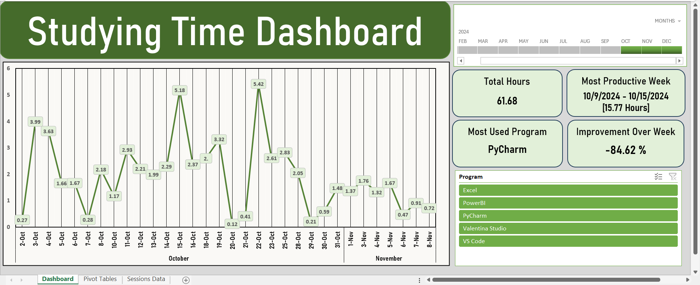

# Coding-Time-Tracker

## Overview
The **Coding Time Tracker** is an automated **`Python`** application that tracks your coding sessions in real time. It runs in the background as soon as you boot your laptop, monitoring IDE usage (like PyCharm or VS Code) and logging session data into a **`SQLite`** database. With an accompanying **`Excel`** dashboard, you can visualize your coding habits, track weekly improvements, and optimize your productivity.

## Skills Demonstrated

- **Python Programming**: Developed a robust application using **`Python`** **(PyInstaller)**, showcasing skills in **scripting** and **automation**.
- **Database Management**: Designed a **`SQLite`** database to efficiently store session data, demonstrating understanding of database concepts and **`SQL`** queries.
- **Real-Time Process Monitoring**: Utilized the **`psutil`** library to monitor running processes, illustrating the ability to work with system resources and manage real-time data.
- **User Notifications**: Integrated the **`win10toast`** library to send timely notifications, enhancing user experience and promoting healthy coding habits.
- **Data Visualization**: Created a comprehensive **`Excel`** dashboard to visualize tracked data, highlighting proficiency in data analysis and presentation.
- **Automation and Scheduling**: Implemented functionality for the application to start automatically on system boot, showcasing skills in application deployment and task automation.
- **Problem Solving**: Addressed challenges related to process detection, data storage, and user notifications, exemplifying critical thinking and troubleshooting abilities.


## Features
- Automatically starts tracking when your laptop boots up.
- Monitors usage of IDEs (PyCharm, VS Code, Excel, Power BI, and Valentina Studio).
- Logs session start and end times, along with duration in minutes.
- Sends notifications after 45 minutes and 1 hour of continuous coding.
- Provides an Excel dashboard for tracking data and weekly improvements.

## Usage
**1. Clone the repository:** ```git clone https://github.com/<username>/Coding-Time-Tracker.git```

**2. Install the required dependencies:** (if you want to modify the code) ``` pip install win10toast psutil pyinstaller ```

**3. Run the application:** The program will automatically run in the background (without a GUI), tracking your coding sessions.

**4. Make it Run Automatically:**
* **Windows:** To ensure the program starts automatically every time you boot your laptop:
  - Press Win + R, type shell:startup, and hit Enter.
  - Create a shortcut of the coding_time_tracker.exe (the executable file created by PyInstaller) in this folder.
        
* **macOS:** For macOS users:
  - open System Preferences, navigate to Users & Groups, select your user account, and then click on Login Items.
  - Add your application to this list to launch it at startup.
 
**5. Dashboard:** You can access the Excel dashboard to track your coding sessions, analyze weekly improvements, and more!



## Contact
For questions or contributions, please reach out to me at zakoutkhalil@gmail.com. You can also connect with me on [LinkedIn](https://www.linkedin.com/in/khalil-zakout/).
